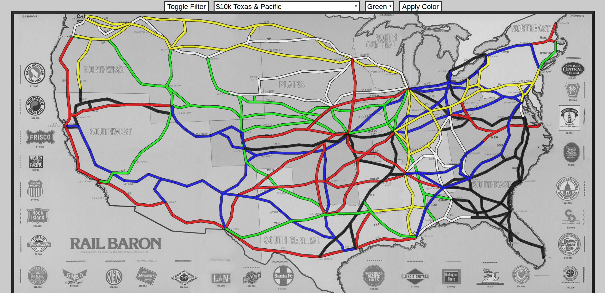
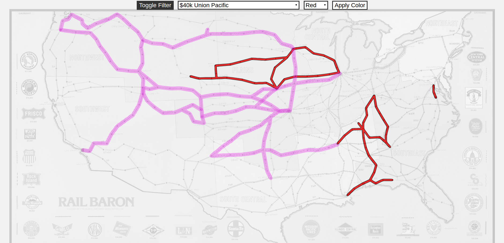

# Rail Baron Interactive Map

I made this quick app to help track the progress of games of Rail Baron.

You can select lines either by clicking on the line directly or by using the dropdown menu.  
Choose a color with the second dropdown, and click "Apply Color" to apply the color to the selected line.

The filter toggle allows you to see only lines that belong to the currently selected color  or that are still unowned.

## Screenshots

If this map is helpful to you, I'd be excited to hear about it.

---

## Copyright

The game Rail Baron was originally created by Avalon Hill, then sold to Hasbro Interactive.

Rail Baron is now an internationally registered trademark of Intersystem Concepts, Inc.

